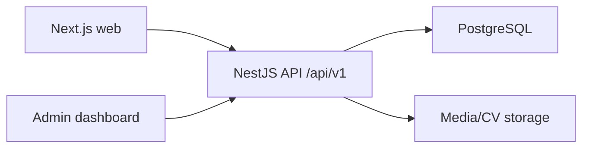

# Arquitectura

Portfolio Platform separa frontend y backend para que cada parte pueda evolucionar y desplegarse de forma independiente.

## Separación

- `apps/web`: Next.js, TypeScript, Tailwind CSS, shadcn/ui y Framer Motion.
- `apps/api`: NestJS REST API, Swagger, Prisma y PostgreSQL.
- `packages/shared`: tipos y datos seed compartidos.
- `infra`: Docker Compose y contenedores.

El frontend consume la API REST. No accede a PostgreSQL ni a Prisma.

## Comunicación

## Evolución a microservicios

La API está organizada por módulos: Auth, Profile, Theme, Experience, Projects, ContactMessages, CV, Analytics y Admin. En el futuro, CV Manager, Media o Analytics podrían extraerse a servicios independientes sin cambiar la interfaz pública del frontend.
